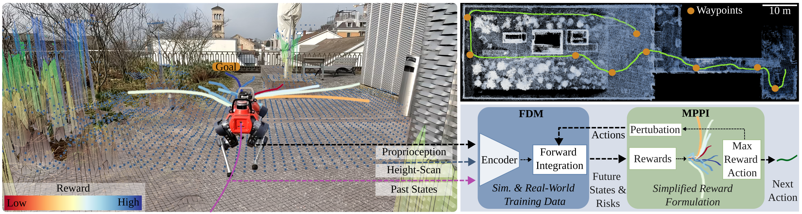

<p align="center">
  
</p>

<h1 align="center" style="margin-bottom: 0;">
  <br>
  The GrandTour Dataset
  <br>
</h1>
<p align="center">
  <em><small>A project brought to you by <a href="https://rsl.ethz.ch/">RSL - ETH Zurich</a>.</small></em>
</p>
<p align="center">
  <a href="#references">References</a> •
  <a href="#hugging-face-instructions">Hugging Face</a> •
  <a href="#ros1-instructions">ROS1</a> •
  <a href="#contributing">Contributing</a> •
  <a href="#news">News</a> •
  <a href="#citation">Citation</a>
</p>

## References

Please first visit the [official webpage](https://grand-tour.leggedrobotics.com/) to learn more about the available data, hardware setup, and registration.

- 📄 **GrandTour dataset paper (arXiv preprint):** [https://arxiv.org/abs/2602.18164](https://arxiv.org/abs/2602.18164)
- 🌐 **Official dataset page:** [https://grand-tour.leggedrobotics.com/dataset](https://grand-tour.leggedrobotics.com/dataset)
- 🧭 **Localization challenge page (soon available):** [https://grand-tour.leggedrobotics.com/tasks/localization](https://grand-tour.leggedrobotics.com/tasks/localization)
- 🤗 **Hugging Face dataset:** [https://huggingface.co/datasets/leggedrobotics/grand_tour_dataset](https://huggingface.co/datasets/leggedrobotics/grand_tour_dataset)
- 💻 **GrandTour examples repository:** [https://github.com/leggedrobotics/grand_tour_dataset](https://github.com/leggedrobotics/grand_tour_dataset)
- 🔩 **Boxi software (sensor payload):** [https://github.com/leggedrobotics/grand_tour_box](https://github.com/leggedrobotics/grand_tour_box)

Visit our [sponsors and partners](https://grand-tour.leggedrobotics.com/about), including **Leica Geosystems (Hexagon)**.

---

<br>

## Projects using the GrandTour Dataset

> This is a growing list of known public projects/papers using GrandTour data (directly or as curated source data).

| Project | Preview |
| --- | --- |
| [**Physical Terrain Parameter Learning**](https://github.com/leggedrobotics/physical_terrain_parameter_learning) <br> *Learning simulation parameters from RGB and proprioception.* |  |
| [**Forward Dynamics Model Learning (FDM)**](https://github.com/leggedrobotics/fdm) <br> *Learning platform-aware forward dynamics for safer navigation.* |  |
| [**Holistic Fusion**](https://github.com/leggedrobotics/holistic_fusion) <br> *Holistic state estimation.* |  |
| [**RESPLE: Recursive Spline LIO**](https://asig-x.github.io/resple_web/) <br> *LiDAR-inertial odometry benchmarked on GrandTour-style data.* |  |
| [**LiMo: Less Is More (Scalable Visual Navigation)**](https://arxiv.org/abs/2601.17815) <br> *Extends GrandTour deployments with large-scale embodiment-specific trajectories.* | — |
| [**DeFM: Learning Foundation Representations from Depth**](https://arxiv.org/abs/2601.18923) <br> *Uses GrandTour in a large real-world depth pretraining corpus.* | — |
| [**WildOS: Open-Vocabulary Object Search in the Wild**](https://arxiv.org/abs/2602.19308) <br> *Trains frontier prediction using annotated images from GrandTour.* | — |
| [**NaviTrace: Evaluating Embodied Navigation of VLMs**](https://arxiv.org/abs/2510.26909) <br> *Uses curated image samples from the publicly available GrandTour dataset.* | — |

---

<br>

## Hugging Face Instructions

You can find Jupyter notebooks and scripts with full instructions in the [`examples_hugging_face`](./examples_hugging_face) directory.

### Installation Instructions

<details>
<summary>Click for installation details</summary>

These steps assume you are using **[uv](https://github.com/astral-sh/uv)** for dependency management.

### 1. Install using `uv`

```bash
pip3 install uv
uv sync
cd examples_hugging_face
uv sync
uv run scripts/download_data.py
```

</details>

### 📒 Jupyter Notebook Examples

* **[Accessing/Downloading GrandTour Data](./examples_hugging_face/notebooks/access.ipynb)**  
  *Learn how to download the GrandTour datasets from Hugging Face.*

* **[Exploring GrandTour Data](./examples_hugging_face/notebooks/explore.ipynb)**  
  *Explore the dataset structure and learn how to work with Zarr data.*

### 🐍 Python Scripts

* **[zarr_transforms.py](./examples_hugging_face/scripts/zarr_transforms.py)**  
  *Demonstrates how to use transforms and provides helper functions for Zarr data.*

* **[plot_lidar_3d.py](./examples_hugging_face/scripts/plot_lidar_3d.py)**  
  *Visualize LiDAR data in 3D space.*

* **[project_lidar_on_image.py](./examples_hugging_face/scripts/project_lidar_on_image.py)**  
  *Project LiDAR points onto camera images, accounting for camera distortion and relative motion.*

* **[dynamic_points_filtering_using_images.py](./examples_hugging_face/scripts/dynamic_points_filtering_using_images.py)**  
  *Removes dynamic objects from LiDAR point clouds using image segmentation and saves results in Zarr format.*

* **[generate_elevation_maps.py](./examples_hugging_face/scripts/generate_elevation_maps.py)**  
  *Generates elevation maps from LiDAR and depth cameras.*

* **[nerfstudio_convert.py](./examples_hugging_face/scripts/nerfstudio_convert.py)**  
  *Converts datasets into nerfstudio format for training Gaussian Splatting models.*

---

<br>

## ROS1 Instructions

### Download

<details>
<summary>Click here</summary>

To access and download the GrandTour dataset ROS bags, please follow these steps:

#### 1. Register for Access

- **Register here:** [Google Form Registration](https://forms.gle/2qJkGYJ6oxnBvdNq9)

#### 2. Download ROS bags

**Option 1 – Command Line Interface (Recommended):**

Install the CLI tool and log in:

```bash
pip3 install kleinkram
klein login
```

- You can now explore the CLI using tab-completion or the `--help` flag.

**Download multiple files via Python scripting:**

```bash
python3 examples_kleinkram/kleinkram_cli_example.py
```

**Directly convert ROS bags to PNG images (requires ROS1 installation):**

```bash
python3 examples_kleinkram/kleinkram_extract_images.py
```

**Option 2 – Web Interface:**

- Use the [GrandTour Dataset Web Interface](https://datasets.leggedrobotics.com/#/) to browse and download data directly.

</details>

### Installation

<details>
<summary>Click here</summary>

### Create Folders
```shell
mkdir -p ~/grand_tour_ws/src
mkdir -p ~/git
```

### Clone and Link Submodules
> **⚠️ Note:** The repository structure is under active development (ROS2/MCAP support is being added). Commands below may evolve.

```shell
# Clone the repository
cd ~/git
git clone git@github.com:leggedrobotics/grand_tour_dataset.git
cd grand_tour_dataset; git submodule update --init

# Checkout only the required packages from the grand_tour_box repository for simplicity
cd ~/git/grand_tour_dataset/examples_ros1/submodules/grand_tour_box
git sparse-checkout init --cone
git sparse-checkout set box_model box_calibration box_drivers/anymal_msgs box_drivers/gnss_msgs

# Link the repository to the workspace
ln -s ~/git/grand_tour_dataset/examples_ros1 ~/grand_tour_ws/src/
```

### Setup and Build Catkin Workspace

```shell
cd ~/grand_tour_ws
catkin init
catkin config --extend /opt/ros/noetic
catkin config --cmake-args -DCMAKE_BUILD_TYPE=RelWithDebInfo
catkin build grand_tour_ros1
source devel/setup.bash
```

### Download Example Mission

```shell
mkdir -p ~/grand_tour_ws/src/examples_ros1/data
cd ~/grand_tour_ws/src/examples_ros1/data
pip3 install kleinkram
klein login
klein download --mission 3c97a27e-4180-4e40-b8af-59714de54a87
```

</details>

### Examples

#### Terminal 1: Launch LiDARs

```shell
roslaunch grand_tour_ros1 lidars.launch

# URDFs are automatically loaded by:
#    Boxi:     box_model box_model.launch
#    ANYmal:   anymal_d_simple_description load.launch
```

#### Terminal 2: Replay Bags

```shell
cd ~/grand_tour_ws/src/examples_ros1/data
# We provide an easy interface to replay the bags
rosrun grand_tour_ros1 rosbag_play.sh --help
rosrun grand_tour_ros1 rosbag_play.sh --lidars --tf_model

# We provide two tf_bags
#   tf_model contains frames required for the URDF model of ANYmal and Boxi.
#   tf_minimal contains only core sensor frames.
```

You can also try the same for `cameras.launch`.

**Example Output:**

| **LiDAR Visualization** | **Camera Visualization** |
| --- | --- |
|  <br> _Visualization of LiDAR data using `lidars.launch`._ |  <br> _Visualization of images using `cameras.launch`._ |

#### Image Uncompression and Rectification

We provide a launch file to uncompress images and publish rectified images. Install the required dependencies:

```shell
sudo apt-get install ros-noetic-image-transport
sudo apt-get install ros-noetic-compressed-image-transport
```

```shell
roslaunch grand_tour_ros1 cameras_helpers.launch
```

#### IMUs Visualization

We use `rqt-multiplot` to visualize the IMU measurements.

Install [rqt_multiplot](https://wiki.ros.org/rqt_multiplot):

```shell
sudo apt-get install ros-noetic-rqt-multiplot -y
```

Start `rqt_multiplot` and replay the bags:

```shell
roslaunch grand_tour_ros1 imus.launch
```

```shell
cd ~/grand_tour_ws/src/examples_ros1/data
rosrun grand_tour_ros1 rosbag_play.sh --imus --ap20
```

**Example Output:**  


---

<br>

## Contributing

We welcome contributions to help improve and expand this project. Whether you're interested in adding new examples, enhancing existing ones, or offering suggestions, feel free to open an issue or reach out directly.

We are particularly looking for contributions in the following areas:

- New and interesting benchmarks
- ROS2 integration and conversion (MCAP / ROS2 tooling)
- Visualization tools (e.g., Viser, etc.)
- Hosting and deployment support in Asia

---

<br>

## News

- **2026-02:** The **GrandTour dataset paper** is now available as an **arXiv preprint**: [arXiv:2602.18164](https://arxiv.org/abs/2602.18164) (submitted to IJRR).
- The **Localization Challenge** page is online (currently marked **postponed**) and will be hosted via EvalAI once opened.
- **MCAP (ROS2)** support is listed as **coming soon** on the official dataset page.
- We continue to expand GrandTour with new deployments, examples, and downstream benchmarks.

---

<br>

## Citation

If you use the **GrandTour dataset**, please cite the dataset paper:

```bibtex
@article{frey2026grandtour,
  title={GrandTour: A Legged Robotics Dataset in the Wild for Multi-Modal Perception and State Estimation},
  author={Frey, Jonas and Tuna, Turcan and Fu, Frank and Patterson, Katharine and Xu, Tianao and Fallon, Maurice and Cadena, Cesar and Hutter, Marco},
  journal={arXiv preprint arXiv:2602.18164},
  year={2026}
}
```

\*Equal contribution: **Jonas Frey** and **Turcan Tuna**.

If you use the **Boxi payload/software** or cite hardware/payload design decisions, please also cite:

```bibtex
@INPROCEEDINGS{Tuna-Frey-Fu-RSS-25,
    AUTHOR    = {Jonas Frey AND Turcan Tuna AND Lanke Frank Tarimo Fu AND Cedric Weibel AND Katharine Patterson AND Benjamin Krummenacher AND Matthias Müller AND Julian Nubert AND Maurice Fallon AND Cesar Cadena AND Marco Hutter},
    TITLE     = {{Boxi: Design Decisions in the Context of Algorithmic Performance for Robotics}},
    BOOKTITLE = {Proceedings of Robotics: Science and Systems},
    YEAR      = {2025},
    ADDRESS   = {Los Angeles, United States},
    MONTH     = {June}
}
```

\*Shared first authorship: **Frey, Tuna, Fu**.
